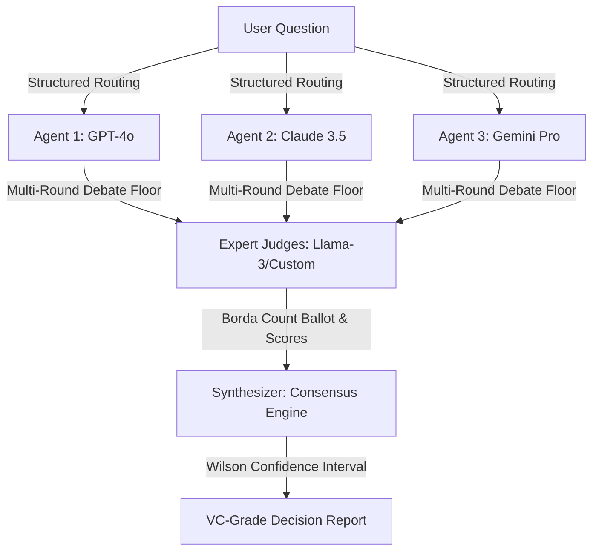

# Product Defensibility & Competitive Positioning Moat

This document details the unique architectural defensibility of the **Consultaion** platform. It serves as a strategic positioning battlecard comparing our multi-agent deliberation workflows against general-purpose, single-LLM conversational endpoints (e.g., ChatGPT, Claude Team, Gemini Advanced).

---

## 1. Executive Summary

General-purpose chatbots are **single-opinion guessers**. They suffer from:
1. **Confirmation Bias:** Agreeing with user prompts instead of challenge-testing assumptions.
2. **Sycophancy:** Submitting to logical contradictions when corrected by humans.
3. **Hidden Hallucinations:** Presenting single-point reasoning that hides uncertainty.

**Consultaion** is a **Decision Intelligence Engine** designed to solve high-stakes problems using structured multi-agent debate, expert judging, and synthesis. We turn model conflict into a measurable, verifiable consensus report.

---

## 2. Core Moats & Technical Defensibility

### Moat A: The Deliberation Framework
* **Traditional LLM:** One prompt -> One completion.
* **Consultaion:** Our platform runs a structured multi-round debate floor. Agents are assigned distinct persona profiles (strategic, critical, empirical) and are forced to dispute arguments, address counter-evidence, and revise claims under rules defined by the system.

### Moat B: Decentralized Evaluation (Impartial Judging)
* **Traditional LLM:** The model evaluates its own reasoning (subjective self-validation).
* **Consultaion:** Judges evaluate agent responses using structured criteria (completeness, accuracy, logical coherence). By separating the **reasoning layer** (Debate Agents) from the **judgment layer** (Judges), we prevent recursive hallucinations.

### Moat C: Deterministic Borda Count Consensus
* **Traditional LLM:** Hard to evaluate response confidence or variance.
* **Consultaion:** Our judges generate numeric ballots. These ballots are aggregated using a Borda count ranking and scored. We compute the Wilson score confidence interval (at 95%) to measure agreement. This makes the final report mathematically defensible.

---

## 3. Competitive Comparison

| Capability | Single LLM (ChatGPT / Claude) | Consultaion Multi-Agent Engine |
| :--- | :--- | :--- |
| **Response Bias** | High sycophancy; matches user bias. | Low; agents challenge assumptions and find counterarguments. |
| **Logic Verification** | Single-pass guess. | Multi-pass cross-examination across model families (OpenAI, Anthropic, Google). |
| **Consensus Score** | None. | Deterministic Borda Count ballot with Wilson Confidence intervals. |
| **Audit Trails** | Transient chat histories. | Full immutable Hansard logs, judge comments, and score histories. |
| **Compliance Ready** | None. | SOC2-ready audit trail exports (CSV/JSON), BYOK keys, and retention settings. |

---

## 4. Sales Objection Handling

### "Why not just open three tabs and prompt them myself?"
1. **No Deliberation:** In separate tabs, the models cannot talk to each other. They cannot point out logical gaps in each other's reasoning.
2. **No Objective Judging:** You are forced to manually parse 10 pages of text to find where they agree. Our judges score, rank, and summarize the consensus automatically.
3. **No Audit Trail:** You cannot download a structured CSV or JSON audit log of the comparison for executive presentation.

### "Isn't it cheaper to use one model?"
* One single wrong strategic decision (e.g., adopting the wrong compliance framework) can cost an enterprise millions of dollars. The incremental cost of running a multi-agent debate (pennies per run) pays for itself instantly by highlighting fatal risks before rollout.
