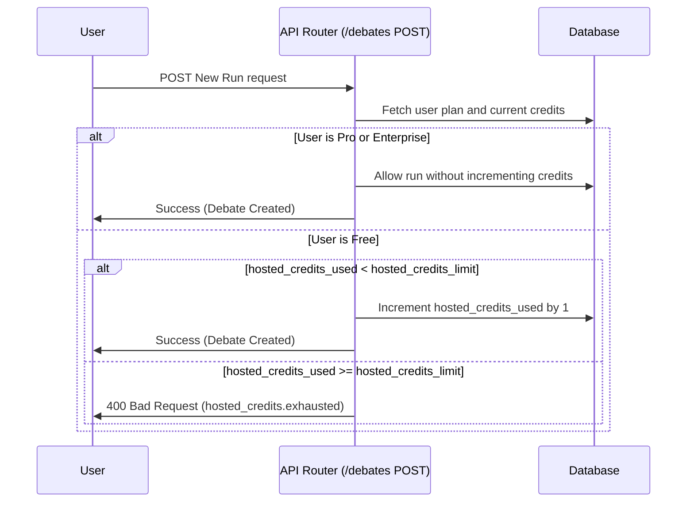

# Hosted Credits MVP

This document outlines the design and enforcement mechanism for the Hosted Credits system, introducing monetization loops for the free trial tier.

## 1. Credit Allocation and Quotas
Every registered user starts with a free quota of hosted credits:
* **Default Free Plan**: Allocates `hosted_credits_limit = 10` upon signup.
* **Pro & Enterprise Plans**: Unlimited runs (not constrained by free hosted credits).
* **Credit Tracking**: Managed via three database columns on the `user` table:
  * `hosted_credits_limit`: Maximum number of runs the user can initiate using our hosted resources.
  * `hosted_credits_used`: Counter tracking how many runs have been executed.
  * `hosted_credit_source`: Metadata field (e.g. `"signup"`, `"promotion"`) tracking allocation context.

## 2. Enforcement Workflow

## 3. Failure Refund Policy
To ensure high quality and user satisfaction (vital for VC due diligence and PLG metrics):
* If a background run fails terminally during LLM execution (e.g., due to downstream LLM provider outages), the system automatically refunds the credit.
* The orchestrator's exception handling path queries the user and decrements `hosted_credits_used` by `1` (ensuring it never falls below `0`).
* Paid users (Pro/Enterprise) are unaffected by refund logic since their credits are not tracked/enforced.
