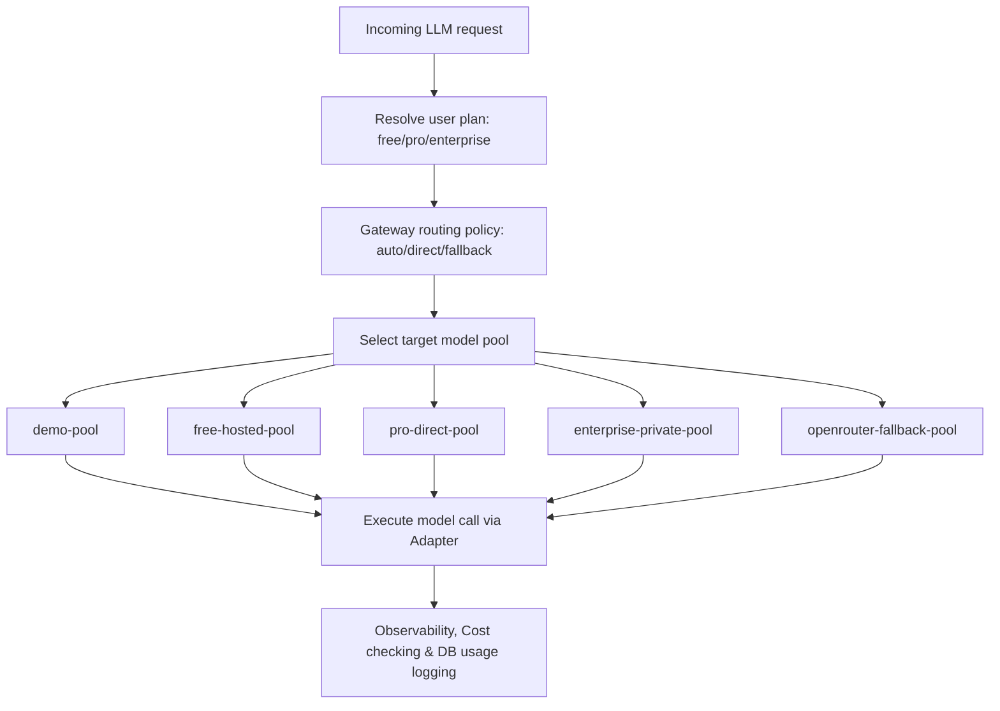

# Model Gateway Production Routing Architecture

This document describes the routing architecture, policies, and pool configuration of the provider-agnostic inference gateway for Consultaion.

## 1. Provider-Agnostic Pools
To prove enterprise robustness and avoid single-point aggregator failures (like OpenRouter dependency), LLM requests are routed through curated pool strategies:
* **`demo-pool`**: Dedicated to test mock environments and guest previews.
* **`free-hosted-pool`**: Cost-efficient, high-performance open models hosted or routed on free limits.
* **`pro-direct-pool`**: High-availability, tier-1 production API endpoints (e.g. direct Anthropic/OpenAI keys).
* **`enterprise-private-pool`**: Private, dedicated VPS or local enterprise model endpoints ensuring complete data privacy.
* **`openrouter-fallback-pool`**: Allowed fallback to aggregators like OpenRouter when primary API direct endpoints hit rate limits.

## 2. VC-Defensible Routing Policies
Instead of hardcoding APIs, the routing policy selects pools dynamically based on user entitlement and requested tier:
* **Pro Direct Policy**: Routes request directly to direct provider APIs (bypassing open router aggregators).
* **Cost Safety Check**: If a model call is estimated to exceed safety limits, it is proactively blocked before dispatch.
* **Automatic Fallback**: If a primary pool fails with transient connection issues, the model gateway routes the query to the fallback aggregator pool seamlessly.

## 3. Observability and Logging
Every model call routed through the gateway generates a `GatewayDecision` and is logged to:
* **`LLMUsageLog`**: Captures tokens, cost, latency, routing strategy, model pool, and response payload.
* **`UsageCall`**: A standard internal data structure returned to agents containing gateway metadata fields.
