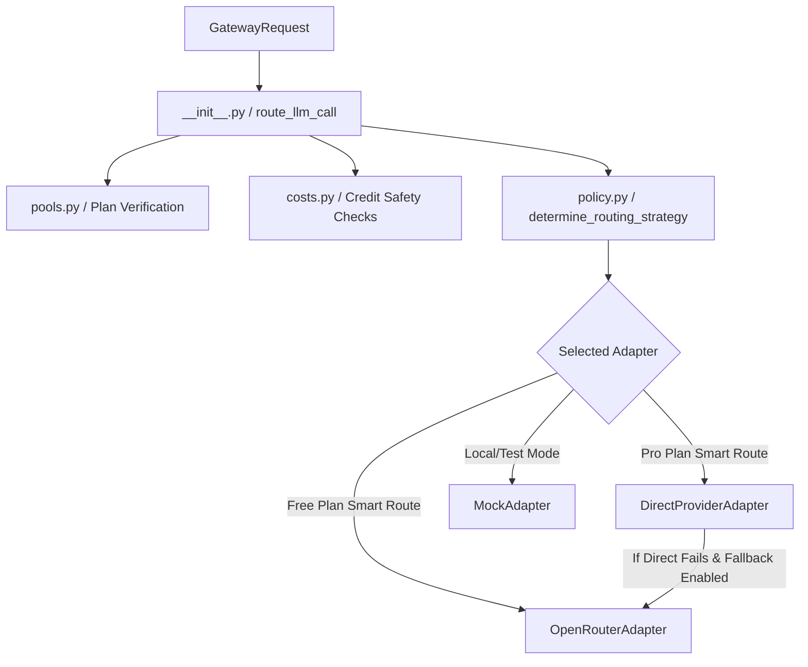

# Production Model Gateway Architectural Design

The Model Gateway acts as the unified decision layer for all outbound LLM inference requests in Consultaion. It decouples the core debate engine and agent execution logic from upstream provider implementations (e.g. LiteLLM, OpenRouter, Direct API keys), offering high availability, cost management, and tier-based routing.

## Core Pillars

### 1. Tier-Based Model Pools (`pools.py`)
Model resources are dynamically categorized into isolated pools to control operating costs and protect quality access:
- **Free Pool (`free_pool`)**: Standard, lower-cost models accessible to all users (including unauthenticated visitors).
- **Pro Pool (`pro_pool`)**: Premier frontier models (e.g. GPT-4o, Claude 3.5 Sonnet, Gemini 1.5 Pro) restricted to authenticated paid plans.

### 2. High-Availability Fallback Policy
Primary direct API calls are wrapped in an autonomous retry-and-redirect circuit.
- If a direct provider suffers an outage (e.g., Anthropic or OpenAI API keys return rate limits or temporary server errors), the gateway catches the exception, registers the failure, and automatically retries using an alternative gateway path (e.g. OpenRouter) as a backup.
- This results in zero user-facing downtime and robust reliability.

### 3. Smart Routing Policy Engine (`policy.py`)
Routes calls dynamically depending on the user's plan and requested model pool:
- **`direct`**: Forces connection to direct API providers (minimum latency).
- **`fallback`**: Attempts direct provider first; falls back to aggregator if primary fails.
- **`auto`**: Routes free plan users through aggregated low-cost smart routers and premium users directly to minimum-latency endpoints.

### 4. Credit & Cost Safety Guardrails (`costs.py`)
Before executing any LLM call, the gateway estimates the request cost based on prompt token size. It blocks execution if:
- A user exceeds the maximum allowed run-cost boundary.
- The user's account runs out of query credits.
