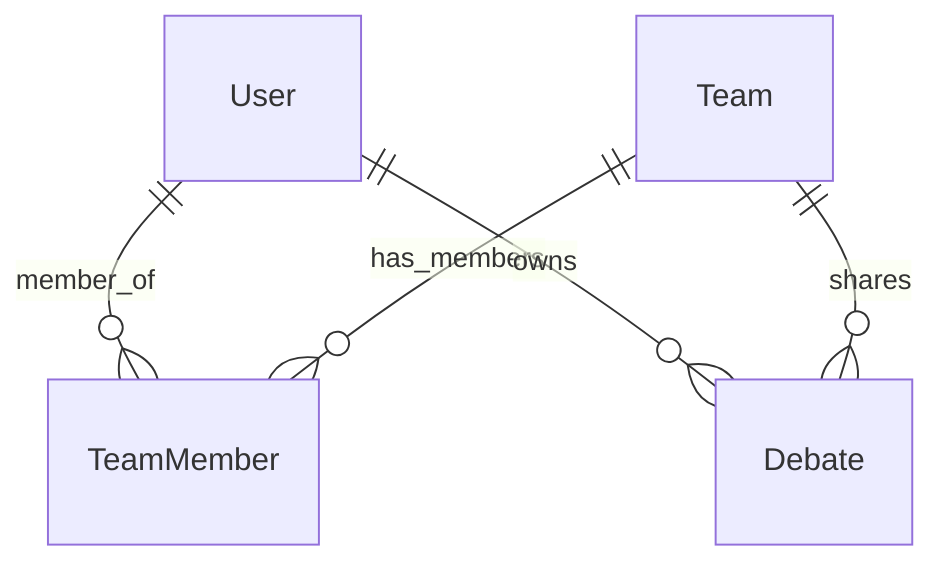

# Multi-Tenancy & Tenant Isolation

This document outlines the multi-tenant architecture and data isolation boundaries implemented in **Consultaion**. 

## 1. Database Schema Mapping
Consultaion implements multi-tenancy at the logical level within a single database schema. The primary actors and entities are:

- **Users (`User` table)**: Represents individual account entities. Each user has a unique ID and role (`user`, `admin`).
- **Teams (`Team` table)**: Represents corporate or group accounts. Teams own shared resources and specify collaborative groups.
- **Team Members (`TeamMember` table)**: Maps users to teams with specific roles (`owner`, `editor`, `viewer`).
- **Debates/Arena Runs (`Debate` table)**: Main operational resource. Each debate possesses:
  - `user_id` (foreign key to the owner user)
  - `team_id` (optional foreign key to the team, enabling shared access among team members)



---

## 2. Access Validation Patterns
Tenant isolation is enforced server-side on every API request:

- **Decorator/Helper Helpers**:
  - `can_access_debate(debate: Debate, user: Optional[User], session: Session) -> bool`:
    - Evaluates if the user is the owner (`debate.user_id == user.id`),
    - Checks if the run is explicitly shared as public (`debate.config.get("is_public") is True`),
    - If the run belongs to a team (`debate.team_id`), verifies the user is a registered member of that team via `user_is_team_member`.
  - `require_debate_access(...)`: Raises a `404 Not Found` error if access checks fail. This prevents bad actors from enumerating valid/invalid debate IDs (rejection via silence).
  - `require_debate_owner(...)`: Restricts mutable operations (deleting, updates, running) strictly to the creator of the debate or an admin.

---

## 3. Query Isolation
Every query fetching collections (e.g., GET `/debates`) applies mandatory tenancy filters before executing:

```python
filters = []
if current_user.role != "admin":
    team_ids = user_team_ids(session, current_user.id)
    if team_ids:
        filters.append((Debate.user_id == current_user.id) | (Debate.team_id.in_(team_ids)))
    else:
        filters.append(Debate.user_id == current_user.id)
```

This ensures that under no circumstances can Team A query or view Team B's run/arena data, even when executing bulk listing operations.

---

## 4. Future Escalation: PostgreSQL Row-Level Security (RLS)
To transition from logical middleware isolation to strict database-enforced isolation as Consultaion scales, the platform can be migrated to **PostgreSQL Row-Level Security (RLS)**.

### Implementation Blueprint
1. **Enable RLS on tables**:
   ```sql
   ALTER TABLE debate ENABLE ROW LEVEL SECURITY;
   ```
2. **Define Session Variables**:
   FastAPI database middleware will set a local transaction variable (e.g., `SET LOCAL app.current_user_id = '...'`) at the start of every request connection block.
3. **Write RLS Policies**:
   Create policies enforcing that rows can only be accessed if the query matches the active user ID or their team IDs:
   ```sql
   CREATE POLICY debate_isolation_policy ON debate
   FOR ALL
   USING (
     user_id = current_setting('app.current_user_id')
     OR team_id IN (
       SELECT team_id FROM teammember WHERE user_id = current_setting('app.current_user_id')
     )
   );
   ```
This offloads the tenancy verification logic to the database query compiler itself, preventing bugs in the application layer from leaking data.
